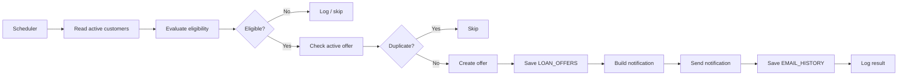

# 🏦 Dream Bank Loan Scheduler API

[](https://www.mulesoft.com/)
[](https://www.oracle.com/java/)
[](LICENSE)
[](https://github.com/Narsing-s/dreambank-loan-schedular/stargazers)
[](https://github.com/Narsing-s/dreambank-loan-schedular/network/members)
[](https://github.com/Narsing-s/dreambank-loan-schedular/issues)
[](https://github.com/Narsing-s/dreambank-loan-schedular/graphs/contributors)

A MuleSoft 4 integration project that automates **pre-approved loan offer generation** for eligible bank customers.

The scheduler retrieves active customer data from Snowflake, evaluates configurable demonstration eligibility rules, prevents duplicate active offers, persists new offers, and records customer notification activity.

> **Portfolio / learning project:** the loan amounts, rates, and eligibility rules are demonstration values and are not real bank underwriting policy.

## ✨ What it demonstrates

- ⏰ Scheduled MuleSoft processing
- 👤 Active-customer retrieval from Snowflake
- 💰 DataWeave-based eligibility evaluation
- 🏠 Home, car, and personal loan offer generation
- 🆔 Unique loan-offer generation
- 🚫 Duplicate active-offer prevention
- 💾 Persistence to `LOAN_OFFERS`
- 📧 HTML email notification flow
- 📜 Notification history in `EMAIL_HISTORY`
- 📊 Logging for monitoring and troubleshooting
- 🌐 REST/API capability for viewing loan offers
- 📱 Notification connector dependency for future/extended channels

## 🖼️ Project Screenshots

### 1. Scheduler / Main Flow


### 2. Customer Data / Snowflake


### 3. Loan Eligibility


### 4. Loan Type / Offer Generation


### 5. Unique Loan Offer ID


### 6. Loan Offer Persistence


### 7. Duplicate Offer Prevention


### 8. HTML Email Notification


### 9. Email History


### 10. WhatsApp Notification


### 11. SMS Notification


### 12. REST API — View Loan Offers


## 🔄 End-to-end flow



## 🧩 Business flow

1. Scheduler starts the processing cycle.
2. Active customer records are retrieved from Snowflake.
3. Eligibility rules are evaluated.
4. Existing active offers are checked.
5. A new offer is generated when appropriate.
6. The offer is persisted.
7. Customer notification content is generated.
8. Notification processing is performed.
9. Notification history is persisted.
10. Execution details are logged.

## 💳 Demonstration eligibility rules

| Account Balance | Loan Type | Offer Amount | Interest Rate | Tenure |
|---|---|---:|---:|---:|
| ₹5,00,000 or above | Home Loan | ₹50,00,000 | 8.25% | 240 months |
| ₹2,00,000 – ₹4,99,999 | Car Loan | ₹10,00,000 | 9.25% | 84 months |
| Below ₹2,00,000 | Personal Loan | ₹2,00,000 | 11.50% | 60 months |

These values are examples for demonstrating integration logic.

## 🛠️ Technology stack

| Technology | Purpose |
|---|---|
| MuleSoft 4.9 | Integration runtime |
| DataWeave 2.0 | Transformation and business-rule mapping |
| Snowflake | Customer/offer persistence |
| Mule Scheduler | Automated execution |
| Email Connector | Customer notifications |
| Amazon SNS Connector | Notification capability |
| HTTP Connector | API capability |
| Maven | Build/package management |
| Java 17 | Runtime requirement |

## 🗄️ Logical data model

```text
BANK_CUSTOMER_DATA
        |
        | customer_id
        v
   LOAN_OFFERS
        |
        | loan_offer_id
        v
  EMAIL_HISTORY
```

See [Data Model](docs/DATA-MODEL.md).

## 📚 Documentation

- [Architecture](docs/ARCHITECTURE.md) — integration flow and MuleSoft concepts
- [Setup & Run Guide](docs/SETUP.md) — prerequisites, configuration and verification
- [Data Model](docs/DATA-MODEL.md) — logical tables and relationships
- [Project Review](docs/PROJECT-REVIEW.md) — strengths and safe next additions
- [Contributing](CONTRIBUTING.md)
- [Security](SECURITY.md)

## 🖼️ Implementation screenshots

The repository contains screenshots demonstrating scheduler processing, transformations, offer generation, persistence, notification output, and API behavior.

## 🧪 Verification

For a local review:

```bash
mvn clean package
```

Then verify the application in Anypoint Studio with environment-specific Snowflake and notification configuration.

See the [Setup & Run Guide](docs/SETUP.md) for the verification checklist.

## 🔐 Security

Never commit:

- Snowflake credentials
- SMTP passwords
- AWS/API tokens
- Private keys
- Production customer information

Use secure environment-specific configuration.

## 📈 GitHub repository metrics

GitHub's **Traffic** page contains repository views and unique visitors, but those traffic numbers are not a permanent public repository field and are not reliable as a README statistic. The badges above show public repository metrics such as stars, forks, issues, license, and contributors.

For traffic, open the repository's **Insights → Traffic** page while signed in as a repository administrator.

## 🚀 Future extensions

Possible future improvements, without changing the current business flow:

- MUnit coverage for eligibility boundaries and duplicate prevention
- OpenAPI contract for the loan-offer API
- Synthetic seed data for repeatable demos
- CI build/test validation
- CloudHub/Runtime Fabric deployment runbook
- Centralized error handling and retry documentation
- Operational dashboard and richer observability

## 👨‍💻 Author

**Narsing Rao Beesetti**  
MuleSoft Developer | Integration Engineer

---

⭐ If this project is useful for learning MuleSoft integration patterns, consider starring the repository.
