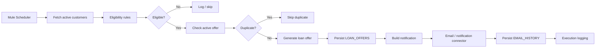

# Dream Bank Loan Scheduler — Architecture

## Purpose

This project demonstrates an automated MuleSoft integration that evaluates active bank customers, creates eligible pre-approved loan offers, persists the offer, and records customer notification activity.

## End-to-end flow

## Integration responsibilities

| Layer | Responsibility |
|---|---|
| Scheduler | Starts the automated processing cycle |
| Data access | Reads customer and offer information |
| DataWeave | Transforms data and applies mapping/business rules |
| Eligibility | Selects the applicable loan product |
| Persistence | Stores offers and notification history |
| Notification | Sends customer-facing HTML communication |
| Observability | Provides logs for troubleshooting and audit support |

## MuleSoft concepts demonstrated

- Mule Scheduler
- Flow/sub-flow orchestration
- DataWeave 2.0 transformations
- Snowflake integration
- Email integration
- Amazon SNS connector dependency
- HTTP listener/API capability
- Duplicate prevention
- Logging and error-oriented troubleshooting
- Maven-based Mule application packaging

## Important design note

The repository is a portfolio/learning implementation. Loan eligibility values are demonstration business rules and should not be treated as real bank underwriting policy.
